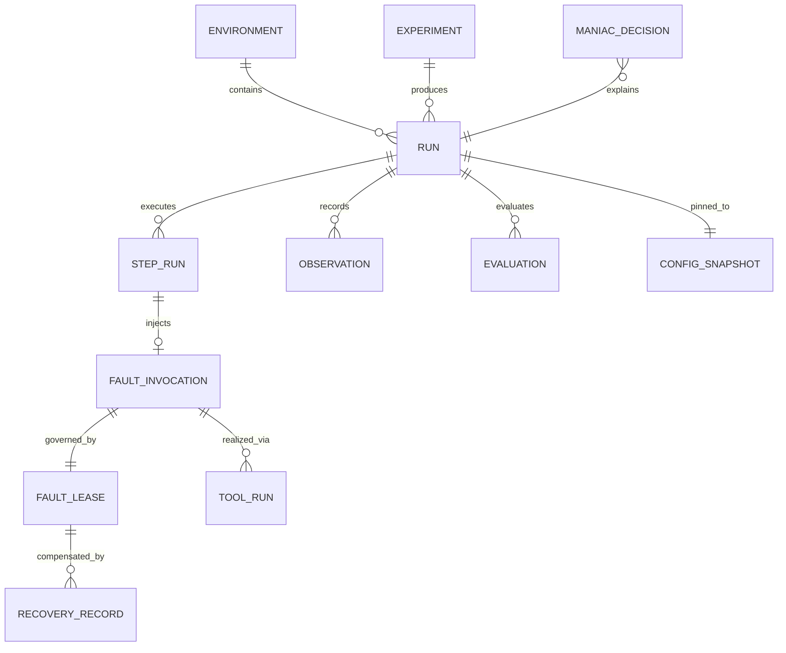

# Domain Model

Pure dataclasses/pydantic models in `src/mayhem/domain/` — **zero IO**, importable by every layer
([ADR-0002](../adr/0002-python-single-package-layered-monorepo.md)). This page is the vocabulary
contract: names here are used verbatim in code, storage, and protocol.

---

## 1. Entity catalog

### Environment & topology

| Entity | Key fields | Notes |
|---|---|---|
| `Environment` | `name`, `class` (`dev\|staging\|production`), `fingerprint` | fingerprint = SHA256(host set + compose digest + name) — [ADR-0012](../adr/0012-safety-model-environment-identity-and-risk-gates.md) |
| `TopologyGraph` | `nodes: set[Node]`, `edges: set[Edge]` | merged from providers |
| `Node` *(sealed union)* | see below | no runtime-reflection node types |
| `Edge` | `(src, dst, kind)` | kinds below |

```python
Node = HostNode | ContainerNode | ServiceNode | ProcessNode | ExternalDependencyNode
EdgeKind = Literal["RUNS_ON", "DEPENDS_ON", "CONNECTS_VIA", "EXPOSES"]
```

| Node kind | Key fields |
|---|---|
| `HostNode` | id, hostname, ssh_ref?, labels, capability_report? |
| `ContainerNode` | id, name, image, state, ip, networks, ports, healthcheck, service_label, owner_host |
| `ServiceNode` | name (compose service), replicas, depends_on, env, volumes |
| `ProcessNode` | pid, cmdline_pattern, user, owner_host |
| `ExternalDependencyNode` | uri, kind (`postgres\|redis\|http\|…`), inferred_from |

Selection uses `TargetRef` — a declarative selector (`{kind, expr}` e.g.
`{kind: service, expr: postgres}`) resolved against the live graph; resolution happens at plan
validation and again at pre-execution assertion ([ADR-0012](../adr/0012-safety-model-environment-identity-and-risk-gates.md)).

### Agents & capabilities

| Entity | Key fields |
|---|---|
| `AgentInstance` | id, host, pid, roles[], state, last_heartbeat |
| `CapabilityReport` | is_root, cap_net_admin, cap_sys_admin, cgroup_v2, kernel, tool_versions{} |
| `ToolManifest` | tool, provides[], probe{cmd, version_regex}, privilege, risk, fallback_groups |
| `ToolRun` | argv, cwd, env_digest, exit_code, stdout/stderr artifact refs, duration_ms |

Capability IDs are `<domain>.<action>` strings ([ADR-0004](../adr/0004-toolkit-capability-registry.md)):
`proc.kill`, `proc.pause`, `cpu.pressure`, `mem.pressure`, `fs.fill`, `fs.inodes`,
`net.latency`, `net.partition`, `dns.fail`, `container.kill`, `container.pause`,
`container.exec`, `load.generate`, `http.inject_error`, `db.exhaust_conn`, …

### Faults & execution

| Entity | Key fields |
|---|---|
| `FaultDefinition` | id (`net.latency`), category, params_schema (pydantic), risk, reversible, max_duration, required_caps[], applicable_node_kinds, tags[] |
| `FaultInvocation` | fault_id, targets, frozen params, resolved backend/tool |
| `FaultLease` | state machine (below), expires_at, undo_json (**NOT NULL before active**) |
| `ExperimentSpec` | kind (`deterministic\|random`), metadata, hypothesis, method/constraints |
| `ExecutionPlan` | steps[], seed context, safety envelope |
| `Step` | action union + timeout + on_failure policy |
| `StepAction` *(union)* | `InjectFault \| StartLoad \| StopLoad \| Wait \| CheckSteadyState \| RunProbe \| Notify` |
| `SteadyStateCheck` | probe spec (http/prom/log/exec), expression, expectation, phase (`pre\|during\|post`) |
| `EvaluationResult` | check_id, passed, measured value, phase, timestamp |
| `Observation` | source, kind, payload, occurred_at, window tag |
| `RiskLevel` | `low < medium < high < critical` (ordered enum) |
| `BlastRadiusBudget` | max_services_pct, max_hosts, max_concurrent_faults, duration_cap |
| `ExperimentResult` | status, timeline, evaluations, summary_md, mttr stats |

## 2. Relationships



Storage mapping in [reference/sqlite-schema.md](../reference/sqlite-schema.md).

## 3. State machines

**Run:** `created → planning → validated → running → recovering → completed | failed | aborted`

**Step:** mirrors run subset + `skipped`.

**Lease** ([ADR-0005](../adr/0005-recovery-model-lease-journal-janitor.md)):

```
pending ──inject──► active ──duration/abort──► releasing ──verified──► released
   │                   │                          │
   └─ never activated  ├─ TTL watchdog fires ──► expired (agent self-compensated)
                       └─ owner unreachable ───► orphaned (janitor reclaims)
                                                dirty (compensation failed → escalate loudly)
```

## 4. Invariants (checked by domain validators + integration tests)

1. Every `FaultInvocation` has exactly one lease; a lease's `undo_json` is non-null **before** its
   state can become `active`.
2. A fault may only target nodes whose kind ∈ `applicable_node_kinds` and whose host's
   capabilities satisfy `required_caps`.
3. Sum of concurrent active faults never exceeds the run's blast-radius budget.
4. Every `ToolRun` has an artifact ref; stdout/stderr are never truncated silently (cap ⇒ explicit
   truncation marker).
5. `critical` risk faults require policy opt-in + CLI flag at compile time, not just at runtime.
6. Random plans pass the identical validation path as deterministic plans.
7. Observations attach to a run or step; orphans are rejected at write time.

## 5. Serialization rules

- Domain models serialize to JSON for: SQLite rows (`spec`, `plan`, `undo_json`, `payload`),
  protocol messages, and journal blocks. Pydantic `model_dump(mode="json")` everywhere; no ad-hoc
  dicts crossing layer boundaries.
- Enums serialize as their string values; timestamps as ISO-8601 UTC.
