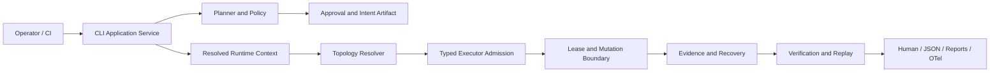

# v0.9.0 Architecture and Decisions

## Target architecture

## Data flow

1. Parse a drill and load target/policy configuration.
2. Resolve the engine exactly once into a `RuntimeContext`.
3. Resolve topology and target identity without mutation.
4. Compile a plan with typed faults, checks, compensation, and evidence requirements.
5. Compute blast radius, policy decision, fingerprints, and capability verdict.
6. Create an approval/intention artifact bound to the plan hash and expiry.
7. Admit each fault against the resolved target type and runtime capabilities before lease creation.
8. Acquire write-ahead lease state, execute through the runtime adapter, and capture redacted observations.
9. Verify the expected effect, attempt compensation, verify compensation, and assess residual impact.
10. Persist a replay capsule and evidence bundle; expose degraded state if persistence fails.
11. Provide replay, compare, recovery, and reporting commands over the same artifacts.

## ADR-001: One resolved runtime context

**Status:** Accepted for v0.9.0

**Decision:** Introduce an immutable runtime context containing engine, target profile, namespace/context, runtime version, provider version, and capability verdict. Pass it through discovery, planning, safety, execution, and evidence.

**Alternatives:**

- Continue passing raw engine strings — rejected because different phases currently default differently.
- Re-resolve at execution time — rejected because the plan could execute against a different runtime than it was approved for.

**Consequences:** One additional context model and migration work, but deterministic plans and auditable evidence.

## ADR-002: Explicit intent for every mutation

**Status:** Accepted for v0.9.0

**Decision:** All mutating commands require an explicit execution intent. Preview commands are named previews. Any compatibility mutation path must be separately named, visibly unsafe, and excluded from CI examples.

**Consequences:** More user friction, substantially less accidental mutation, and a uniform approval/audit contract.

## ADR-003: Capability truth is a state machine

**Status:** Accepted for v0.9.0

**Decision:** Represent capability status as a typed record with separate `registered`, `available`, `unit_verified`, `live_verified`, `compensation_complete`, and `blocked` dimensions. Never collapse them into one boolean.

**Consequences:** More verbose output, but the product can accurately explain Docker/Podman/Kubernetes differences.

## ADR-004: Evidence is durable and replayable

**Status:** Accepted for v0.9.0

**Decision:** Add a replay capsule and an evidence hash chain. Evidence persistence failure is visible as `degraded`, never silently discarded.

**Consequences:** Schema and migration work, but artifacts can be verified independently and safely shared.

## ADR-005: Universal redaction boundary

**Status:** Accepted for v0.9.0

**Decision:** Redaction is a domain service invoked before persistence and rendering. The service accepts structured values, environment mappings, command argv, URLs, and text output, returning redacted values plus a redaction report.

**Consequences:** Provider adapters must stop writing directly to durable stores. Redaction metrics become testable.

## ADR-006: Kubernetes live verification is a separate profile

**Status:** Accepted for v0.9.0

**Decision:** Unit tests and manifest/dry-run tests remain the default CI tier. Live conformance runs are opt-in, versioned, authorized, and recorded as dated evidence artifacts.

**Consequences:** CI stays safe and reproducible; live claims require an explicit conformance process.

## ADR-007: Architecture debt is remediated in vertical slices

**Status:** Accepted for v0.9.0

**Decision:** Do not perform a broad file move. Each new feature must place its code in the correct boundary and add import-contract coverage. Existing violations are tracked and reduced by focused migrations.

**Consequences:** Incremental risk reduction instead of a risky monolithic refactor.

## Provider and extension boundary

Provider entry points receive a capability manifest and a permission declaration. Loading a provider must not grant target mutation authority. The planner resolves provider capabilities into typed plans, and execution only occurs through the existing lease, safety, and compensation boundaries.

## Data model additions

- `RuntimeContext`: resolved engine and runtime identity.
- `ExecutionIntent`: plan hash, approval, expiry, actor, scope, and break-glass metadata.
- `CapabilityStatus`: lifecycle dimensions and human-readable reasons.
- `ReplayCapsule`: normalized inputs, versions, fingerprints, seed, and artifact digests.
- `EvidenceBundle`: envelope, observations, lease timeline, compensation, residual impact, and hash chain.
- `ConformanceArtifact`: environment manifest, test profile, date, runtime versions, and result references.

## Failure boundaries

- Parse/config failure: no topology access, no mutation.
- Topology ambiguity: require explicit target/engine, no mutation.
- Capability mismatch: typed refusal before lease creation.
- Policy refusal: preserve plan and reason, no lease.
- Tool failure: capture bounded redacted output, compensate if acquired, mark degraded.
- Controller loss: leases become orphaned; recovery can identify and compensate without assuming a new controller identity.
- Evidence failure: mark run degraded and emit a recovery-safe result; do not claim complete evidence.
